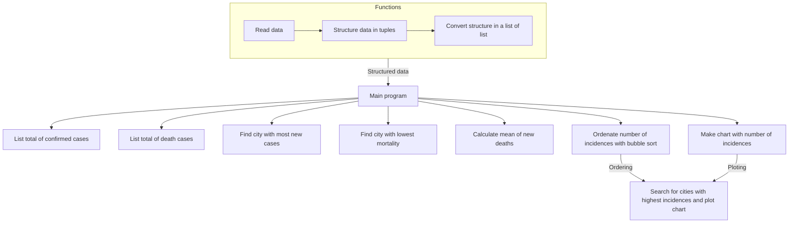
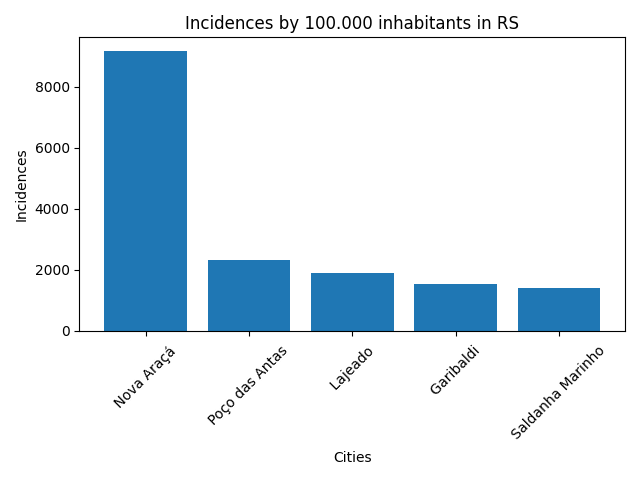
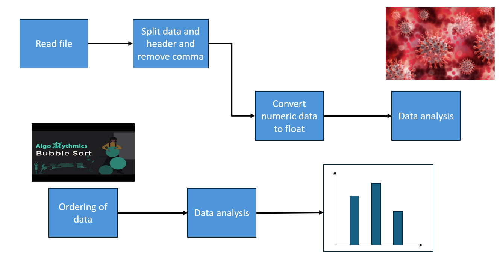

# COVID-19 Data Analysis Project

This project process a file with COVID-19 data for Rio Grande do Sul (RS), Brazil, to perform analyses and generate visualizations. The objective was to calculate and present key statistics and insights about the pandemic's impact on the region.

## Objectives

- Calculate total number of confirmed cases in RS (current and new)
- Calculate total deaths in RS (current and new)
- Identify the city with the most new cases in RS
- Identify the city with the lowest mortality in RS
- Compute the average number of new deaths in RS
- Generate a bar plot showing the five cities with highest incidence of cases in RS

## Project Structure

The project was developed using several functions to achieve the objectives:



## Setup Instructions

1. Clone Repository:
```bash
git clone <repository-url>
cd <repository-directory>
```

2. Setup Virtual Environment:
```bash
python -m venv .venv
source .venv/Scripts/activate
```

3. Install Dependencies:
```bash
pip install -r requirements.txt
```
or
```bash
poetry install
```

4. Prepare Data File:
Ensure you have the required CSV file with COVID-19 data.

5. Run Script:
```bash
python main.py
```

## Main Results

#### Total Confirmed Cases:
```mathematica
Number of confirmed cases = 23157
```

#### Total Deaths:
```mathematica
Number of death cases = 523
```

#### City with Most New Cases:
```mathematica
City with most new cases: Porto Alegre
```

#### City with Lowest Mortality:
```mathematica
City with lowest mortality: Santa Maria
```

#### Mean of New Deaths
```mathematica
Mean of new deaths: 0.06
```

#### Incidence Bar Plot:


### Libraries Used

- `matplotlib`: for creating visualizations.

--------------------


